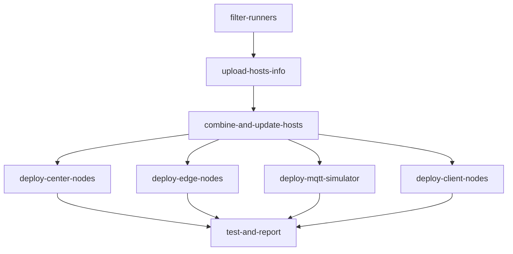
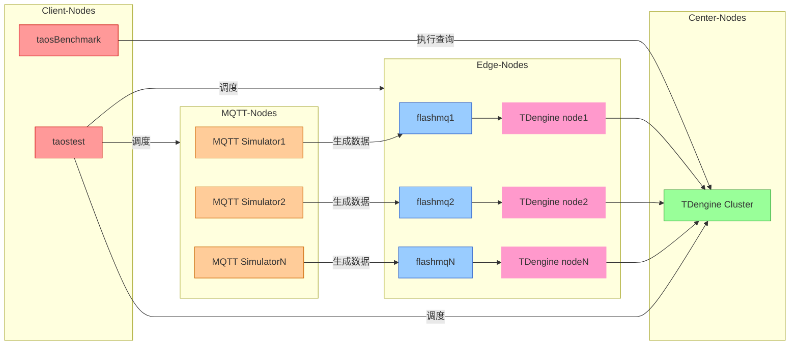

简体中文 | [English](README.md)

# EMS Test
EMS(Energy Management System) 客户场景基于分布式架构，旨在实现 MQTT 数据流、边缘节点、中心节点以及客户端之间的高效协同，满足复杂场景下的数据采集、处理和同步需求。

为便于用户在不同环境中快速部署和测试，本仓库提供了两种灵活的部署方式：


- **Workflow 自动部署**：通过 GitHub Actions 自动部署集群环境并运行测试，适合在 CI/CD 或云端环境中使用。【见下文】

- **Docker Compose 本地部署**：通过 Docker Compose 在本地快速搭建测试环境，适合本地开发测试或演示。【见[ Docker Compose 部署 ]( ./docker-compose )】

# 目录
- [EMS Test](#ems-test)
- [目录](#目录)
  - [1. 使用说明](#1-使用说明)
    - [1.1 手动触发 Workflow](#11-手动触发-workflow)
    - [1.2 登录 taos-explorer 查看运行情况](#12-登录-taos-explorer-查看运行情况)
  - [2. 工作流程](#2-工作流程)
    - [阶段概览](#阶段概览)
    - [关键 Job 说明](#关键-job-说明)
  - [3. 组件拓扑图](#3-组件拓扑图)
  - [4. 测试场景](#4-测试场景)
  - [5. 配置文件说明](#5-配置文件说明)
    - [5.1 数据库参数配置 (db\_config.json)](#51-数据库参数配置-db_configjson)
    - [5.2 查询参数配置 (query.json)](#52-查询参数配置-queryjson)
  - [6. 测试结果](#6-测试结果)
  - [7. 环境要求](#7-环境要求)
    - [必要 Secrets](#必要-secrets)
    - [节点标签要求](#节点标签要求)
  - [8. 常见问题](#8-常见问题)
    - [Q1: 如何修改测试配置参数？](#q1-如何修改测试配置参数)
    - [Q2: 参数选择有什么建议？](#q2-参数选择有什么建议)
    - [Q3: 如何调试失败的测试？](#q3-如何调试失败的测试)
    - [Q4: 是否使用了用户提供的数据？](#q4-是否使用了用户提供的数据)


## 1. 使用说明

### 1.1 手动触发 Workflow
1. 进入仓库的 [Actions](https://github.com/taosdata/ems/actions) 选项卡；
2. 选择 [EMS Test](https://github.com/taosdata/ems/actions/workflows/ems-test.yml) workflow；
3. 点击 **Run workflow** 按钮，填写参数：

| 参数名称               | 描述                     | 类型    | 必需 | 默认值    | 选项          |
|------------------------|--------------------------|---------|------|-----------|---------------|
| td-version           | TDengine 版本           | string  | ✅   | 3.3.5.5  | -             |
| edge-dnode-count     | 边缘节点数量            | choice  | ✅   | 2        | 1/2           |
| center-dnode-count   | 中心节点数量            | choice  | ✅   | 3        | 1/2/3         |
| exec-time            | 测试执行时长 (秒)       | string  | ✅   | 300      | -             |
| source-interval      | 数据源间隔 (毫秒)       | string  | ✅   | 1000     | -             |
| enable-compression   | 启用数据压缩            | choice  | ✅   | false    | true/false    |

4. 点击刚刚启动的 **workflow**，可以在下级页面查看详细的运行状态；

5. 全部流程运行完成后，在详情页面最下方 **Artifacts** 区域可下载名为 **perf_report_YYYYMMDD_HHMMSS.txt** 的测试报告。


    🔗 [Workflow Trigger Demo](https://github.com/taosdata/ems/actions/runs/14280051434)

### 1.2 登录 taos-explorer 查看运行情况
1. 打开 taos-explorer 页面：
```markdown
- http://[中心节点IP]:6060
- http://[边缘节点IP]:6060
```
2. 输入用户名密码登录（默认 root/taosdata）
3. 在`数据浏览器`及`数据写入`侧边栏中查看写入情况

## 2. 工作流程

### 阶段概览


### 关键 Job 说明
| Job 名称                   | 功能描述                      | 依赖项                              |
|---------------------------|------------------------------|-------------------------------------|
| filter-runners          | 动态选择指定规格的运行器           | -                                   |
| combine-and-update-hosts| 同步所有节点的 hosts 配置         | filter-runners                      |
| deploy-center-nodes     | 部署中心节点组件                  | combine-and-update-hosts           |
| deploy-edge-nodes       | 部署边缘节点组件                  | combine-and-update-hosts           |
| deploy-mqtt-simulator   | 部署 MQTT 模拟器                 | combine-and-update-hosts           |
| deploy-client-nodes     | 部署客户端测试环境                | combine-and-update-hosts           |
| test-and-report         | 分布式执行测试用例并上传测试报告     | 所有部署阶段                       |


## 3. 组件拓扑图

以下为系统的组件拓扑图，展示了 MQTT 节点、边缘节点、中心节点和客户端节点之间的连接和数据流动。





## 4. 测试场景

| 场景                    | 描述                                           |
|------------------------|------------------------------------------------|
| MQTT 数据采集性能      | 从 MQTT 订阅设备采集数据并写入到边缘节点的存储中      |
| taosx 数据迁移性能     | 将数据从边缘节点迁移到中心节点的存储中               |
| 数据查询性能           | 在数据迁移过程中测试查询 QPS                       |
| 数据压缩性能           | 压缩后数据大小与原始数据大小的比值                  |


## 5. 配置文件说明

位于 `ems/config` 目录下的配置文件用于定义测试行为和数据库参数：

```bash
config/
├── db_config.json    # 数据库参数配置
├── query.json        # 查询参数配置
├── config.yaml       # MQTT 订阅与数据路由配置
├── parser.yaml       # 数据解析与存储规则配置
└── ems.toml          # MQTT 测试数据生成配置
```

### 5.1 数据库参数配置 (db_config.json)

```json
{
    "vgroups": 10,
    "stt_trigger": 2,
    "buffer": 4096,
    "minrows": 100
}
```

| 关键字段       | 作用描述                  |
|---------------|-------------------------|
| vgroups       | 初始 vgroup 的数目        |
| stt_trigger   | 落盘文件触发文件合并的个数   |
| buffer        | 写入内存池大小             |
| minrows       | 文件块中记录的最小条数       |


🔗 更多配置请参考 [TDengine 数据库参数文档](https://docs.taosdata.com/reference/taos-sql/database/#%E5%88%9B%E5%BB%BA%E6%95%B0%E6%8D%AE%E5%BA%93)


### 5.2 查询参数配置 (query.json)
```json
{
    "filetype": "query",
    "cfgdir": "/etc/taos",
    "host": "u2-195",
    "port": 6030,
    "user": "root",
    "password": "taosdata",
    "confirm_parameter_prompt": "no",
    "continue_if_fail": "yes",
    "databases": "center_db",
    "query_times": 100,
    "query_mode": "rest",
    "specified_table_query": {
      "query_interval": 10,
      "concurrent": 10,
      "sqls": [
        {
          "sql": "select last_row(*) from site_topic7_mqtt_1;",
          "result": "./query_res0.txt"
        },
        {
          "sql": "select count(*) from site_topic7_mqtt_1;",
          "result": "./query_res1.txt"
        },
        {
          "sql": "select last(*) from site_topic7_mqtt_1;",
          "result": "./query_res2.txt"
        }
      ]
    },
    "test_log": "/root/testlog/"
}
```

| 关键字段       | 作用描述                  |
|---------------|-------------------------|
| query_times    | 总查询次数               |
| sqls           | 多语句并行测试配置        |
| concurrent     | 并发线程数               |
| query_interval | 查询时间间隔             |


🔗 更多配置请参考 [taosBenchmark 查询配置文档](https://docs.taosdata.com/reference/tools/taosbenchmark/#%E6%9F%A5%E8%AF%A2%E9%85%8D%E7%BD%AE%E5%8F%82%E6%95%B0)


## 6. 测试结果
测试完成后生成的性能报告将作为 Artifact 存储：

```bash
perf_report_YYYYMMDD_HHMMSS.txt
```

包含以下指标：
- 📈 数据写入吞吐量
- ⏱️ 消息延迟分布
- 🗜️ 压缩率
- 🖥️ 资源利用率 (CPU/MEM/Disk)

## 7. 环境要求

### 必要 Secrets
```env
RUNNER_PAT        # 运行器访问令牌
VM_PASSWD         # 节点 SSH 统一密码
PUB_DL_URL        # 测试工具下载地址
ASSETS_DL_URL     # 企业版 TDengine 下载地址
```

### 节点标签要求
```yaml
MQTT_LABEL: "8C16G"     # MQTT 节点规格
EDGE_LABEL: "20C16G"    # 边缘节点规格
CENTER_LABEL: "20C16G"  # 中心节点规格
CLIENT_LABEL: "24C64G"  # 客户端规格
```

## 8. 常见问题

### Q1: 如何修改测试配置参数？
```markdown
1. 触发 workflow 时可以定义一些初始化参数，第 1.1 章节已提供对应的参数定义
2. 修改 ems/config 下的配置文件，第 5 章节中已提供各配置文件的说明
```

### Q2: 参数选择有什么建议？
```markdown
1. 边缘节点数量: 根据 runner 数量配置
2. 数据间隔: 100-5000ms 区间进行阶梯测试，interval 越小，采集频率越高
3. 压缩启用: 当测试网络带宽瓶颈时建议开启
```

### Q3: 如何调试失败的测试？
```markdown
1. 查看 filter-runners job 的节点筛选结果
2. 查看各部署阶段的组件安装日志
```

### Q4: 是否使用了用户提供的数据？
```markdown
我们参考了用户数据进行建模，并没有使用用户提供的数据，因为用户提供的是一个 800M+ 的 CSV 数据文件，不太方便我们在 workflow 或者 docker-compose 中使用。
```