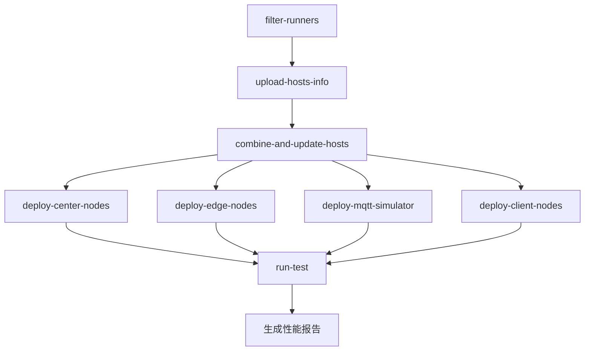

# Fractal Test Workflow

通过 workflow 自动部署集群环境并运行测试，支持多节点分布式环境下的 MQTT 数据流、边缘节点、中心节点和客户端的协调测试。

## 🚀 使用说明

### 手动触发 Workflow
1. 进入仓库的 **Actions** 选项卡
2. 选择 **Fractal Test** workflow
3. 点击 **Run workflow** 按钮，填写参数：

| 参数名称               | 描述                     | 类型    | 必需 | 默认值    | 选项          |
|------------------------|--------------------------|---------|------|-----------|---------------|
| `td-version`           | TDengine 版本           | string  | ✅   | 3.3.5.5  | -             |
| `edge-dnode-count`     | 边缘节点数量            | choice  | ✅   | 2        | 1/2           |
| `center-dnode-count`   | 中心节点数量            | choice  | ✅   | 3        | 1/2/3         |
| `exec-time`            | 测试执行时长 (秒)       | string  | ✅   | 300      | -             |
| `source-interval`      | 数据源间隔 (毫秒)       | string  | ✅   | 1000     | -             |
| `enable-compression`   | 启用数据压缩            | choice  | ✅   | false    | true/false    |

🔗 [Workflow Trigger Demo](https:# github.com/taosdata/fractal/actions/runs/13734315147)

## ⚙️ 工作流程

### 阶段概览


### 关键 Job 说明
| Job 名称                   | 功能描述                          | 依赖项                              |
|---------------------------|-----------------------------------|-------------------------------------|
| `filter-runners`          | 动态选择指定规格的运行器          | -                                   |
| `combine-and-update-hosts`| 同步所有节点的 hosts 配置         | filter-runners                      |
| `deploy-center-nodes`     | 部署中心节点组件                  | combine-and-update-hosts           |
| `deploy-edge-nodes`       | 部署边缘节点组件                  | combine-and-update-hosts           |
| `deploy-mqtt-simulator`   | 部署 MQTT 模拟器                 | combine-and-update-hosts           |
| `deploy-client-nodes`     | 部署客户端测试环境                | combine-and-update-hosts           |
| `run-test`                | 执行分布式测试用例                | 所有部署阶段                       |

## 📁 配置文件说明

位于 `fractal/config` 目录下的配置文件用于定义测试行为和数据库参数：

```bash
config/
├── db_config.json    # 数据库参数配置
├── query.json        # 查询参数配置
└── fractal.toml      # MQTT 模拟器参数配置，一般不需要配置
```

### 1. 数据库参数配置 (db_config.json)
```json
{
    "vgroups": 10,
    "stt_trigger": 2,
    "buffer": 4096,
    "minrows": 100
}
```

| 关键字段       | 作用描述                  |
|---------------|-------------------------|
| vgroups       | 初始 vgroup 的数目        |
| stt_trigger   | 落盘文件触发文件合并的个数   |
| buffer        | 写入内存池大小             |
| minrows       | 文件块中记录的最小条数       |

🔗 参考 [TDengine 数据库参数文档](https:# docs.taosdata.com/reference/taos-sql/database/#%E5%88%9B%E5%BB%BA%E6%95%B0%E6%8D%AE%E5%BA%93)


### 2. 查询配置 (query.json)
```json
{
    "host": "u2-195",
    "port": 6030,
    "databases": "center_db",
    "query_times": 100,
    "specified_table_query": {
        "query_interval": 10,
        "concurrent": 10,
        "sqls": [{
            "sql": "select last_row(*) from site_topic7_u2_193;",
            "result": "./query_res0.txt"
        }]
    }
}
```

| 关键字段       | 作用描述                  |
|---------------|-------------------------|
| query_times    | 总查询次数               |
| sqls           | 多语句并行测试配置        |
| concurrent     | 并发线程数               |
| query_interval | 查询时间间隔             |

🔗 参考 [taosBenchmark 查询配置文档](https:# docs.taosdata.com/reference/tools/taosbenchmark/#%E6%9F%A5%E8%AF%A2%E9%85%8D%E7%BD%AE%E5%8F%82%E6%95%B0)

## 📊 测试结果
测试完成后生成的性能报告将作为 Artifact 存储：

```bash
perf_report_YYYYMMDD_HHMMSS.txt
```

包含以下指标：
- 📈 数据写入吞吐量
- ⏱️ 消息延迟分布
- 🖥️ 资源利用率 (CPU/MEM/Disk)

## 🔧 环境要求

### 必要 Secrets
```env
RUNNER_PAT        # 运行器访问令牌
NAS_DOWNLOAD_URL  # 企业版软件下载地址
VM_PASSWD         # 节点SSH密码
```

### 节点标签要求
```yaml
MQTT_LABEL: "8C16G"     # MQTT 节点规格
EDGE_LABEL: "20C16G"    # 边缘节点规格
CENTER_LABEL: "20C16G"  # 中心节点规格
CLIENT_LABEL: "24C64G"  # 客户端规格
```

## ⁉️ 常见问题

### Q1: 如何访问测试报告？
```markdown
1. 在 Workflow 运行完成后进入 **Summary** 页面
2. 在 **Artifacts** 区域下载报告文件
```

### Q2: 参数选择有什么建议？
```markdown
- 边缘节点数量: 根据 runner 数量配置
- 数据间隔: 100-5000ms 区间进行阶梯测试，interval 越小，采集频率越高
- 压缩启用: 当测试网络带宽瓶颈时建议开启
```

### Q3: 如何调试失败的测试？
```markdown
1. 查看 `filter-runners` job 的节点筛选结果
2. 查看各部署阶段的组件安装日志
```