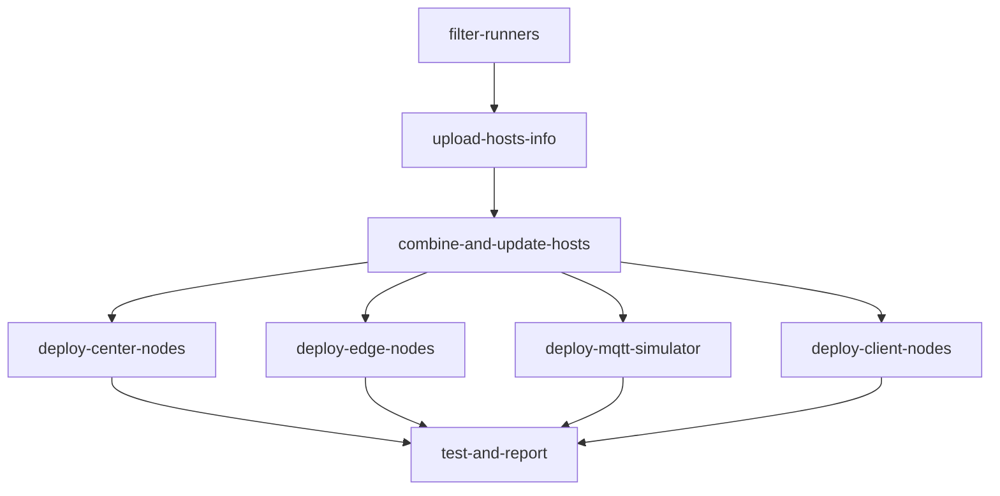
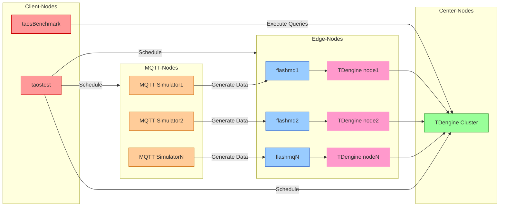

English | [简体中文](README-CN.md)

# EMS Test
The EMS(Energy Management System) customer scenario is based on a distributed architecture, aiming to achieve efficient collaboration between MQTT data streams, edge nodes, central nodes, and clients to meet the data collection, processing, and synchronization requirements in complex scenarios.

To facilitate rapid deployment and testing in different environments, this repository provides two flexible deployment methods:

- **Workflow Auto Deployment**: Automatically deploy the cluster environment and run tests through GitHub Actions, suitable for CI/CD or cloud environments. [See below]
- **Docker Compose Local Deployment**: Quickly set up a test environment locally using Docker Compose, suitable for local development, testing, or demonstrations. [See [Docker Compose Deployment](./docker-compose)]

# Table of Contents
- [EMS Test](#ems-test)
- [Table of Contents](#table-of-contents)
  - [1. Usage Instructions](#1-usage-instructions)
    - [1.1 Manually Trigger Workflow](#11-manually-trigger-workflow)
    - [1.2 Logging into taos-explorer to Monitor Operations](#12-logging-into-taos-explorer-to-monitor-operations)
  - [2. Workflow](#2-workflow)
    - [Phase Overview](#phase-overview)
    - [Key Job Descriptions](#key-job-descriptions)
  - [3. Component Topology](#3-component-topology)
  - [4. Test Scenarios](#4-test-scenarios)
  - [5. Configuration File Description](#5-configuration-file-description)
    - [5.1 Database Parameter Configuration (db\_config.json)](#51-database-parameter-configuration-db_configjson)
    - [5.2 Query Parameter Configuration (query.json)](#52-query-parameter-configuration-queryjson)
  - [6. Test Results](#6-test-results)
  - [7. Environment Requirements](#7-environment-requirements)
    - [Required Secrets](#required-secrets)
    - [Node Label Requirements](#node-label-requirements)
  - [8. Frequently Asked Questions](#8-frequently-asked-questions)
    - [Q1: Any suggestions for parameter selection?](#q1-any-suggestions-for-parameter-selection)
    - [Q2: How to debug failed tests?](#q2-how-to-debug-failed-tests)
    - [Q3: Does the system use user-provided data?](#q3-does-the-system-use-user-provided-data)

## 1. Usage Instructions

### 1.1 Manually Trigger Workflow
1. Go to the [Actions](https://github.com/taosdata/ems/actions) tab of the repository;
2. Select the [EMS Test](https://github.com/taosdata/ems/actions/workflows/ems-test.yml) workflow;
3. Click the **Run workflow** button and fill in the parameters:

| Parameter Name          | Description                     | Type    | Required | Default    | Options          |
|-------------------------|---------------------------------|---------|----------|------------|------------------|
| td-version            | TDengine Version               | string  | ✅       | 3.3.5.5    | -                |
| edge-dnode-count      | Edge Node Count                | choice  | ✅       | 2          | 1/2              |
| center-dnode-count    | Center Node Count              | choice  | ✅       | 3          | 1/2/3            |
| exec-time             | Test Execution Duration (sec)  | string  | ✅       | 300        | -                |
| source-interval       | Data Source Interval (ms)      | string  | ✅       | 1000       | -                |
| enable-compression    | Enable Data Compression        | choice  | ✅       | false      | true/false       |

4. Click the newly started **workflow** to view detailed running status on the subpage;

5. After all processes are completed, download the test report named **perf_report_YYYYMMDD_HHMMSS.txt** from the **Artifacts** section at the bottom of the details page.

🔗 [Workflow Trigger Demo](https://github.com/taosdata/ems/actions/runs/13916584983)

### 1.2 Logging into taos-explorer to Monitor Operations

1. Access the taos-explorer page:
```markdown
- http://[Center_Node_IP]:6060
- http://[Edge_Node_IP]:6060
```
2. Log in with credentials (default: root/taosdata)
3. Check write status in the `Data Browser` and `Data in` sidebar sections

## 2. Workflow

### Phase Overview


### Key Job Descriptions
| Job Name                | Description                          | Dependencies                         |
|-------------------------|--------------------------------------|--------------------------------------|
| filter-runners        | Dynamically select specified runners | -                                    |
| combine-and-update-hosts| Synchronize hosts configuration of all nodes | filter-runners          |
| deploy-center-nodes   | Deploy center node components        | combine-and-update-hosts            |
| deploy-edge-nodes     | Deploy edge node components          | combine-and-update-hosts            |
| deploy-mqtt-simulator | Deploy MQTT simulator               | combine-and-update-hosts            |
| deploy-client-nodes   | Deploy client test environment       | combine-and-update-hosts            |
| test-and-report       | Execute test cases and upload report | All deployment phases               |

## 3. Component Topology

The following is the component topology of the system, showing the connections and data flow between MQTT nodes, edge nodes, center nodes, and client nodes.



## 4. Test Scenarios

| Scenario                | Description                                           |
|-------------------------|-------------------------------------------------------|
| MQTT Data Collection Performance | Collect data from MQTT and write to edge node storage |
| taosx Data Migration Performance | Migrate data from edge nodes to center node storage   |
| Data Query Performance | Test query QPS during data migration                  |
| Data Compression Performance | Ratio of compressed data size to original data size   |

## 5. Configuration File Description

Configuration files located in the `ems/config` directory define test behavior and database parameters:

```bash
config/
├── db_config.json    # Database parameter configuration
├── query.json        # Query parameter configuration
├── config.yaml       # MQTT subscription & data routing configuration
├── parser.yaml       # Data parsing & storage rules configuration
└── ems.toml      # MQTT simulator parameter configuration (usually no need to configure)
```

### 5.1 Database Parameter Configuration (db_config.json)

```json
{
    "vgroups": 10,
    "stt_trigger": 2,
    "buffer": 4096,
    "minrows": 100
}
```

| Key Field       | Description                  |
|-----------------|-----------------------------|
| vgroups         | Initial number of vgroups    |
| stt_trigger     | Number of files to trigger merging |
| buffer          | Write memory pool size       |
| minrows         | Minimum number of records in a file block |

🔗 For more configurations, refer to [TDengine Database Parameter Documentation](https://docs.tdengine.com/tdengine-reference/sql-manual/manage-databases/#create-database)

### 5.2 Query Parameter Configuration (query.json)
```json
{
    "host": "u2-195",
    "port": 6030,
    "databases": "center_db",
    "query_times": 100,
    "specified_table_query": {
        "query_interval": 10,
        "concurrent": 10,
        "sqls": [{
            "sql": "select last_row(*) from site_topic7_u2_193;",
            "result": "./query_res0.txt"
        }]
    }
}
```

| Key Field       | Description                  |
|-----------------|-----------------------------|
| query_times     | Total number of queries     |
| sqls            | Parallel test configuration for multiple SQL statements |
| concurrent      | Number of concurrent threads |
| query_interval  | Query interval              |

🔗 For more configurations, refer to [taosBenchmark Query Configuration Documentation](https://docs.tdengine.com/tdengine-reference/tools/taosbenchmark/#query-parameters)

## 6. Test Results
The performance report generated after testing is stored as an Artifact:

```bash
perf_report_YYYYMMDD_HHMMSS.txt
```

It includes the following metrics:
- 📈 Data write throughput
- ⏱️ Message latency distribution
- 🗜️ Compression ratio
- 🖥️ Resource utilization (CPU/MEM/Disk)

## 7. Environment Requirements

### Required Secrets
```env
RUNNER_PAT        # Runner access token
VM_PASSWD         # Unified SSH password for all nodes
PUB_DL_URL        # Test tool download URL
ASSETS_DL_URL     # TDengine Enterprise Edition download URL
```

### Node Label Requirements
```yaml
MQTT_LABEL: "8C16G"     # MQTT node specification
EDGE_LABEL: "20C16G"    # Edge node specification
CENTER_LABEL: "20C16G"  # Center node specification
CLIENT_LABEL: "24C64G"  # Client specification
```

## 8. Frequently Asked Questions

### Q1: Any suggestions for parameter selection?
```markdown
- Edge node count: Configure based on runner count
- Data interval: Perform step testing in the 100-5000ms range; smaller interval means higher collection frequency
- Enable compression: Recommended when testing network bandwidth bottlenecks
```

### Q2: How to debug failed tests?
```markdown
1. Check the node selection results in the `filter-runners` job
2. Check the component installation logs in each deployment phase
```

### Q3: Does the system use user-provided data?
```markdown
We referenced user data for modeling purposes but did not directly utilize the user-provided data. Because while we analyzed user data for modeling, the 800MB+ CSV file provided wasn't suitable for workflow/docker-compose integration.
```