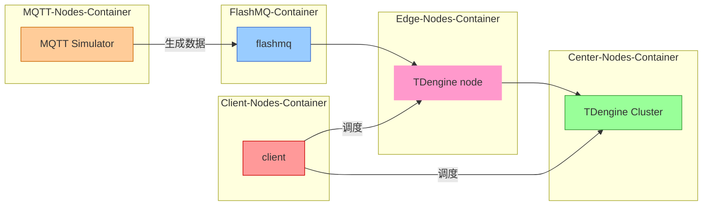

简体中文 | [English](README.md)

# Docker-compose For EMS Test

通过 Docker Compose 自动部署 EMS(Energy Management System) 测试环境并运行测试，支持多节点分布式环境下的 MQTT 数据流、边缘节点、中心节点和客户端的协调测试。

# 目录

- [Docker-compose For EMS Test](#docker-compose-for-ems-test)
- [目录](#目录)
  - [1. 使用说明](#1-使用说明)
    - [手动启动 Docker Compose](#手动启动-docker-compose)
    - [参数说明](#参数说明)
  - [2. 工作流程](#2-工作流程)
    - [关键组件说明](#关键组件说明)
  - [3. 组件拓扑图](#3-组件拓扑图)
  - [4. 配置文件说明](#4-配置文件说明)
    - [4.1 数据库参数配置](#41-数据库参数配置)
    - [4.2 MQTT 模拟器配置](#42-mqtt-模拟器配置)
  - [5. 环境要求](#5-环境要求)
    - [必要端口](#必要端口)
  - [6. 常见问题](#6-常见问题)
    - [Q1: 该模式部署是否生成测试报告？](#q1-该模式部署是否生成测试报告)
    - [Q2: 如何调试失败的测试？](#q2-如何调试失败的测试)
    - [Q3: 如何修改 MQTT 数据发布间隔？](#q3-如何修改-mqtt-数据发布间隔)
    - [Q4: 是否使用了用户提供的数据？](#q4-是否使用了用户提供的数据)

## 1. 使用说明

### 手动启动 Docker Compose
1. 确保已安装 Docker 和 Docker Compose。
2. 克隆仓库并进入项目目录：
```bash
git clone <repository-url>
cd <repository-folder>/docker-compose
```
3. 启动所有服务：
```bash
docker-compose up -d
```
4. 验证服务是否正常运行：
```bash
docker-compose ps
```
5. 服务均正常启动后可登录 taos-explorer 前端（默认用户名密码：root/taosdata）：
```markdown
边缘节点：http://[宿主机IP]:7060
中心节点：http://[宿主机IP]:6060
```
6. 在`数据浏览器`及`数据写入`页面中您可以：
- 实时查看数据写入状态
- 执行查询获取结果
- 停止/启动相关任务


> **NOTE:**
> 在 docker-compose 部署模式下，数据写入不会自动停止，可前往`数据写入`页面手动终止相关任务。
>

### 参数说明
| 参数名称               | 描述                     | 类型    | 必需 | 默认值    |
|------------------------|--------------------------|---------|------|-----------|
| center-host          | 中心节点主机名           | string  | ✅   | center-node |
| edge-host            | 边缘节点主机名           | string  | ✅   | edge-node1-tdengine  |
| mqtt-host            | MQTT 节点主机名         | string  | ✅   | edge-node1-flashmq |
| edge-dbname          | 边缘节点数据库名称       | string  | ✅   | mqtt_datain |
| center-dbname        | 中心节点数据库名称       | string  | ✅   | center_db |

## 2. 工作流程


### 关键组件说明
| 组件名称               | 功能描述                          | 依赖项                              |
|------------------------|-----------------------------------|-------------------------------------|
| center-node          | 中心节点 TDengine 服务           | -                                   |
| edge-node1-flashmq   | 边缘节点 MQTT 服务               | -                                   |
| edge-node1-tdengine  | 边缘节点 TDengine 服务           | edge-node1-flashmq                |
| client-node          | 客户端测试环境                    | edge-node1-tdengine 和 center-node |
| mqtt-simulator       | MQTT 数据模拟器                  | edge-node1-flashmq                |

## 3. 组件拓扑图

以下为系统的组件拓扑图，展示了 MQTT 节点、边缘节点、中心节点和客户端节点之间的连接和数据流动。



## 4. 配置文件说明

### 4.1 数据库参数配置
- **中心节点**：
  - `TAOS_FQDN`: 设置为 `center-node`。
  - `TAOS_FIRST_EP`: 设置为 `center-node`。
- **边缘节点**：
  - `TAOS_FQDN`: 设置为 `edge-node1-tdengine`。
  - `TAOS_FIRST_EP`: 设置为 `edge-node1-tdengine`。
  - `MQTT_HOST`: 设置为 `edge-node1-flashmq`。

### 4.2 MQTT 模拟器配置
- **MQTT 模拟器**：
  - `MQTT_PUB_INTERVAL`: 设置为 `1000`（数据发布间隔，单位为毫秒）。
  - `EDGE_HOST`: 设置为 `edge-node1-flashmq`。

## 5. 环境要求

### 必要端口
确保以下端口可用：
- `6030`, `6041`, `6060`（中心节点 TDengine）
- `7030`, `7041`, `7060`（边缘节点 TDengine）
- `1883`（FlashMQ）

## 6. 常见问题

### Q1: 该模式部署是否生成测试报告？
```markdown
这种部署模式不会生成测试报告，测试报告暂时只在 workflow 中支持，docker-compose 的用途更倾向于本地搭建演示环境，部署完成后需要登陆 taos-explorer 查看结果。
```

### Q2: 如何调试失败的测试？
```markdown
1. 查看 docker-compose logs <service-name> 日志。
2. 检查端口是否被占用或服务是否正常启动。
```

### Q3: 如何修改 MQTT 数据发布间隔？
```
在 docker-compose.yml 中修改 mqtt-simulator 服务的 MQTT_PUB_INTERVAL 环境变量。
```

### Q4: 是否使用了用户提供的数据？
```markdown
我们参考了用户数据进行建模，并没有使用用户提供的数据，因为用户提供的是一个 800M+ 的 CSV 数据文件，不太方便我们在 workflow 或者 docker-compose 中使用。
```