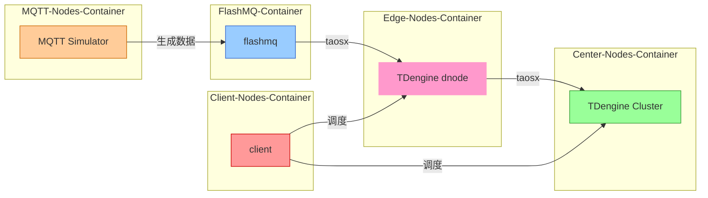

# Docker-compose for Fractal-test

通过 Docker Compose 自动部署集群环境并运行测试，支持多节点分布式环境下的 MQTT 数据流、边缘节点、中心节点和客户端的协调测试。

# 目录
1. [使用说明](#1-使用说明)
1. [工作流程](#2-工作流程)
1. [组件拓扑图](#3-组件拓扑图)
1. [配置文件说明](#4-配置文件说明)
    - [4.1 数据库参数配置](#41-数据库参数配置)
    - [4.2 MQTT 模拟器配置](#42-mqtt-模拟器配置)
1. [测试结果](#5-测试结果)
1. [环境要求](#6-环境要求)
1. [常见问题](#7-常见问题)

## 1. 使用说明

### 手动启动 Docker Compose
1. 确保已安装 Docker 和 Docker Compose。
2. 克隆仓库并进入项目目录：
   ```bash
   git clone <repository-url>
   cd <repository-folder>
   ```
3. 启动所有服务：
   ```bash
   docker-compose up -d
   ```
4. 验证服务是否正常运行：
   ```bash
   docker-compose ps
   ```

### 参数说明
| 参数名称               | 描述                     | 类型    | 必需 | 默认值    |
|------------------------|--------------------------|---------|------|-----------|
| `center-host`          | 中心节点主机名           | string  | ✅   | center-node |
| `edge-host`            | 边缘节点主机名           | string  | ✅   | edge-node1  |
| `mqtt-host`            | MQTT 主机名             | string  | ✅   | edge-node1-flashmq |
| `edge-dbname`          | 边缘节点数据库名称       | string  | ✅   | mqtt_datain |
| `center-dbname`        | 中心节点数据库名称       | string  | ✅   | center_db |

## 2. 工作流程


### 关键组件说明
| 组件名称               | 功能描述                          | 依赖项                              |
|------------------------|-----------------------------------|-------------------------------------|
| `center-node`          | 中心节点 TDengine 服务           | -                                   |
| `edge-node1-flashmq`   | 边缘节点 MQTT 服务               | -                                   |
| `edge-node1-tdengine`  | 边缘节点 TDengine 服务           | `edge-node1-flashmq`                |
| `client-node`          | 客户端测试环境                    | `edge-node1-tdengine` 和 `center-node` |
| `mqtt-simulator`       | MQTT 数据模拟器                  | `edge-node1-flashmq`                |

## 3. 组件拓扑图

以下为系统的组件拓扑图，展示了 MQTT 节点、边缘节点、中心节点和客户端节点之间的连接和数据流动。



## 4. 配置文件说明

### 4.1 数据库参数配置
- **中心节点**：
  - `TAOS_FQDN`: 设置为 `center-node`。
  - `TAOS_FIRST_EP`: 设置为 `center-node`。
- **边缘节点**：
  - `TAOS_FQDN`: 设置为 `edge-node1-tdengine`。
  - `TAOS_FIRST_EP`: 设置为 `edge-node1-tdengine`。
  - `MQTT_HOST`: 设置为 `edge-node1-flashmq`。

### 4.2 MQTT 模拟器配置
- **MQTT 模拟器**：
  - `MQTT_PUB_INTERVAL`: 设置为 `1000`（数据发布间隔，单位为毫秒）。
  - `EDGE_HOST`: 设置为 `edge-node1-flashmq`。

## 5. 测试验证
组件启动后可以登录 taos-explorer 前端验证数据写入情况及查询结果：
- 边缘节点：http://$your_ip:7060
- 中心节点：http://$your_ip:6060

## 6. 环境要求

### 必要端口
确保以下端口可用：
- `6030`, `6041`, `6060`（中心节点 TDengine）
- `7030`, `7041`, `7060`（边缘节点 TDengine）
- `1883`（FlashMQ）

## 7. 常见问题

### Q1: 如何访问测试报告？
```markdown
1. 在项目目录下查找生成的报告文件。
2. 使用文本编辑器或命令行工具查看报告内容。
```

### Q2: 如何调试失败的测试？
```markdown
1. 查看 `docker-compose logs <service-name>` 日志。
2. 检查端口是否被占用或服务是否正常启动。
```

### Q3: 如何修改 MQTT 数据发布间隔？
```markdown
在 `docker-compose.yml` 中修改 `mqtt-simulator` 服务的 `MQTT_PUB_INTERVAL` 环境变量。
```