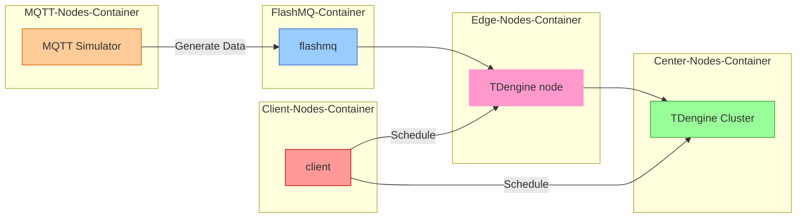

English | [简体中文](README-CN.md)

# Docker-compose for Fractal-test

Automatically deploy a cluster environment and run tests using Docker Compose, supporting coordinated testing of MQTT data streams, edge nodes, central nodes, and clients in a multi-node distributed environment.

# Table of Contents
- [Docker-compose for Fractal-test](#docker-compose-for-fractal-test)
- [Table of Contents](#table-of-contents)
  - [1. Usage Instructions](#1-usage-instructions)
    - [Manually Start Docker Compose](#manually-start-docker-compose)
    - [Parameter Description](#parameter-description)
  - [2. Workflow](#2-workflow)
    - [Key Component Descriptions](#key-component-descriptions)
  - [3. Component Topology](#3-component-topology)
  - [4. Configuration File Description](#4-configuration-file-description)
    - [4.1 Database Parameter Configuration](#41-database-parameter-configuration)
    - [4.2 MQTT Simulator Configuration](#42-mqtt-simulator-configuration)
  - [5. Environment Requirements](#5-environment-requirements)
    - [Required Ports](#required-ports)
  - [6. Frequently Asked Questions](#6-frequently-asked-questions)
    - [Q1: How to access the test report?](#q1-how-to-access-the-test-report)
    - [Q2: How to debug failed tests?](#q2-how-to-debug-failed-tests)
    - [Q3: How to modify the MQTT data publishing interval?](#q3-how-to-modify-the-mqtt-data-publishing-interval)

## 1. Usage Instructions

### Manually Start Docker Compose
1. Ensure Docker and Docker Compose are installed.
2. Clone the repository and navigate to the project directory:
  ```bash
  git clone <repository-url>
  cd <repository-folder>/docker-compose
  ```
3. Start all services:
  ```bash
  docker-compose up -d
  ```
4. Verify if the services are running properly:
  ```bash
  docker-compose ps
  ```
5. Once all services are running, log in to the taos-explorer frontend to verify data writing and query results:
  ```markdown
  Edge Node: http://$your_ip:7060
  Central Node: http://$your_ip:6060
  ```

### Parameter Description
| Parameter Name          | Description                     | Type    | Required | Default    |
|-------------------------|---------------------------------|---------|----------|------------|
| center-host           | Central Node Hostname           | string  | ✅       | center-node |
| edge-host             | Edge Node Hostname              | string  | ✅       | edge-node1  |
| mqtt-host             | MQTT Hostname                   | string  | ✅       | edge-node1-flashmq |
| edge-dbname           | Edge Node Database Name         | string  | ✅       | mqtt_datain |
| center-dbname         | Central Node Database Name      | string  | ✅       | center_db |

## 2. Workflow

### Key Component Descriptions
| Component Name          | Description                          | Dependencies                         |
|-------------------------|--------------------------------------|--------------------------------------|
| center-node           | Central Node TDengine Service        | -                                    |
| edge-node1-flashmq    | Edge Node MQTT Service               | -                                    |
| edge-node1-tdengine   | Edge Node TDengine Service           | edge-node1-flashmq                 |
| client-node           | Client Test Environment              | edge-node1-tdengine and center-node |
| mqtt-simulator        | MQTT Data Simulator                  | edge-node1-flashmq                 |

## 3. Component Topology

The following is the component topology of the system, showing the connections and data flow between MQTT nodes, edge nodes, central nodes, and client nodes.



## 4. Configuration File Description

### 4.1 Database Parameter Configuration
- **Central Node**:
  - `TAOS_FQDN`: Set to `center-node`.
  - `TAOS_FIRST_EP`: Set to `center-node`.
- **Edge Node**:
  - `TAOS_FQDN`: Set to `edge-node1-tdengine`.
  - `TAOS_FIRST_EP`: Set to `edge-node1-tdengine`.
  - `MQTT_HOST`: Set to `edge-node1-flashmq`.

### 4.2 MQTT Simulator Configuration
- **MQTT Simulator**:
  - `MQTT_PUB_INTERVAL`: Set to `1000` (data publishing interval in milliseconds).
  - `EDGE_HOST`: Set to `edge-node1-flashmq`.

## 5. Environment Requirements

### Required Ports
Ensure the following ports are available:
- `6030`, `6041`, `6060` (Central Node TDengine)
- `7030`, `7041`, `7060` (Edge Node TDengine)
- `1883` (FlashMQ)

## 6. Frequently Asked Questions

### Q1: How to access the test report?
```markdown
1. Locate the generated report file in the project directory.
2. Use a text editor or command-line tool to view the report content.
```

### Q2: How to debug failed tests?
```markdown
1. Check logs using `docker-compose logs <service-name>`.
2. Verify if ports are occupied or services are running properly.
```

### Q3: How to modify the MQTT data publishing interval?
```markdown
Modify the `MQTT_PUB_INTERVAL` environment variable for the `mqtt-simulator` service in `docker-compose.yml`.
```